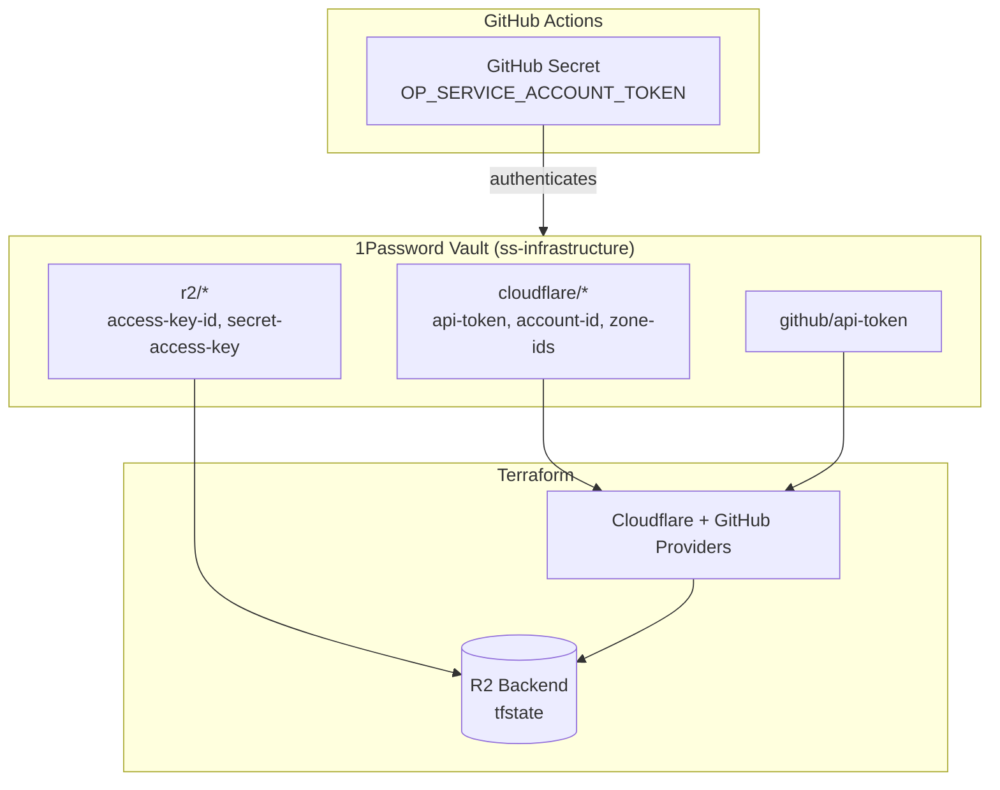
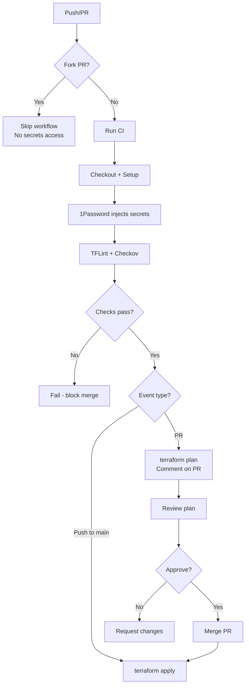

# Signal Stratum Infrastructure

[](https://github.com/signalstratum/infrastructure/actions/workflows/terraform.yml)

Infrastructure as Code for [Signal Stratum Consulting](https://signalstratum.com) — managed declaratively with Terraform and secured via 1Password.

## 🏗️ What This Manages

| Resource | Provider | Status |
|----------|----------|--------|
| **DNS** (signalstratum.com, .io) | Cloudflare | ✅ Active |
| **Email Routing** (catch-all → Gmail) | Cloudflare | ✅ Active |
| **Security Settings** (TLS 1.2+, strict SSL) | Cloudflare | ✅ Active |
| **GitHub Repository Settings** | GitHub | ✅ Active |
| **Branch Protection** (signed commits, status checks) | GitHub | ✅ Active |

## 🔐 Security Architecture



One secret in GitHub. Everything else in 1Password.

## 🛡️ Security Controls

| Control | Implementation |
|---------|----------------|
| **Signed Commits** | GPG key required for all commits to main |
| **Branch Protection** | PRs required, status checks must pass |
| **Linear History** | Squash merge only, no merge commits |
| **Push Restrictions** | Only repo owner can push to main |
| **Fork Protection** | Workflows don't run on fork PRs |
| **SHA-Pinned Actions** | All GitHub Actions pinned to commit SHAs |
| **Secret Scanning** | Push protection enabled |
| **Code Owners** | All changes require owner review |
| **Dependency Updates** | Renovate dashboard (manual approval) |

## 🚀 How It Works

### CI/CD Workflow



### Workflow Logic

1. **Fork protection** — workflow skips entirely for fork PRs. No secrets exposed, no wasted compute.
2. **Lint + security scan** — TFLint catches Terraform issues, Checkov catches security misconfigs. Both must pass.
3. **Plan on PR** — every PR gets a plan commented. Review actual changes before merge.
4. **Apply on merge** — only `main` branch triggers apply. Linear history means clean state progression.

### Local Development

```bash
# Install 1Password CLI: https://developer.1password.com/docs/cli/get-started

# Run Terraform with 1Password secrets
cd terraform
op run --env-file=../.env.tpl -- terraform plan
```

## 📁 Repository Structure

```
.
├── .github/
│   ├── CODEOWNERS               # Code ownership (all files → owner)
│   └── workflows/
│       └── terraform.yml        # CI/CD pipeline
├── terraform/
│   ├── providers.tf             # Provider + R2 backend configuration
│   ├── variables.tf             # Input variables
│   ├── cloudflare.tf            # Zone data sources
│   ├── dns.tf                   # DNS records (future)
│   ├── email_routing.tf         # Email routing configuration
│   ├── security.tf              # Zone security settings
│   └── github.tf                # GitHub repo + branch protection
├── .checkov.yaml                # Security scanner config
├── .env.tpl                     # 1Password env template (local dev)
├── renovate.json                # Dependency update dashboard
├── SECURITY.md                  # Vulnerability reporting policy
└── README.md
```

## 🛠️ Setup

### Prerequisites

- [Terraform](https://terraform.io) >= 1.14.0
- [1Password CLI](https://developer.1password.com/docs/cli/get-started) (for local dev)
- GPG key for commit signing
- Access to `ss-infrastructure` vault in 1Password

### Initial Setup (Done ✅)

1. Created `infrastructure` repo manually (bootstrap exception)
2. Created 1Password service account with read access to `ss-infrastructure` vault
3. Added `OP_SERVICE_ACCOUNT_TOKEN` to GitHub repository secrets

### Adding New Secrets

1. Add to 1Password vault `ss-infrastructure`
2. Reference in workflow: `op://ss-infrastructure/item-name/field-name`
3. Add to `.env.tpl` for local development

## 📋 Roadmap

- [x] Repository setup with R2 backend
- [x] GitHub Actions workflow with 1Password
- [x] Cloudflare zone connectivity
- [x] Cloudflare email routing (catch-all)
- [x] Cloudflare security settings (TLS, HTTPS)
- [x] GitHub repository management via Terraform
- [x] Branch protection (signed commits, status checks)
- [x] Security hardening (CODEOWNERS, SECURITY.md)
- [ ] Cloudflare Pages deployment
- [ ] Additional DNS records as needed

## Design Decisions

### 1Password for Secrets

Single secret in GitHub (service account token). Everything else lives in 1Password. Auditable, rotatable, and if I ever need to add collaborators they just get vault access.

### Public Repository

No secrets in code, everything references 1Password. Public visibility keeps me honest about security practices and serves as a portfolio piece.

### Bootstrap Exception

This repo was created manually—it's the only exception. Terraform imported and now manages all settings.

### Renovate over Dependabot

Dependabot PRs can't access secrets (fork protection), so they'd fail CI. Renovate dashboard mode shows all updates in one issue. I review, check the box, author the PR myself. Maintains GPG signing and I stay in control.

---

**Signal Stratum Consulting** — *Maximum leverage, any layer*
