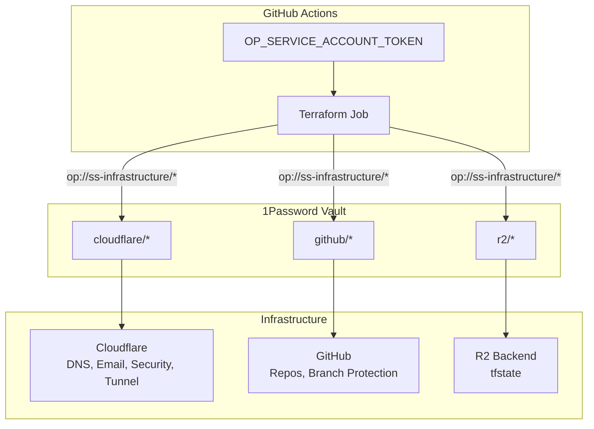
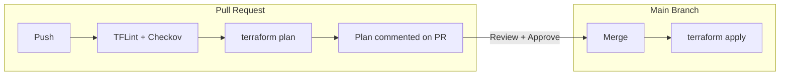

# Infrastructure

IaC for Signal Stratum. Terraform manages Cloudflare and GitHub resources, with secrets injected from 1Password at runtime.

## What's Managed

| Resource | Provider |
|----------|----------|
| DNS (signalstratum.com, .io) | Cloudflare |
| Email routing → Gmail | Cloudflare |
| Zone security (TLS 1.2+, strict SSL) | Cloudflare |
| Zero Trust tunnel (Virginia Talos cluster) | Cloudflare |
| Repositories + branch protection | GitHub |
| Actions permissions (allowed orgs) | GitHub |

## Architecture



One secret in GitHub. Everything else lives in 1Password.

## CI/CD Workflow



- **Fork PRs** skip entirely (no secrets access)
- **Feature PRs** run plan, comment results for review
- **Main branch** auto-applies after merge

## Structure

```
terraform/
├── providers.tf    # Backend (R2) + provider configs
├── variables.tf    # Inputs (via TF_VAR_ from 1Password)
├── locals.tf       # Computed values
├── outputs.tf      # All outputs
├── cloudflare.tf   # Zones, tunnel, DNS, email, security
├── github.tf       # Org settings, repositories
└── modules/
    ├── github-repository/   # Standardized repo + branch protection
    └── onepassword-item/    # Store terraform-generated secrets
```

## Secrets

```
ss-infrastructure/
├── cloudflare/api-token
├── cloudflare/account-id
├── cloudflare/com-zone-id
├── cloudflare/io-zone-id
├── github/api-token
└── r2/access-key-id, secret-access-key, url
```

## Local Development

```bash
cd terraform
op run --env-file=../.env.tpl -- terraform plan
```

## Branch Protection

- Signed commits required
- Squash merge only
- Status checks must pass
- Owner bypass for solo dev workflow

## Adding Resources

1. Add to appropriate `.tf` file
2. `terraform plan` locally to verify
3. PR → review plan → merge
4. Apply runs automatically

## Adding Secrets

1. Add to 1Password vault `ss-infrastructure`
2. Reference in workflow as `op://ss-infrastructure/item/field`
3. Add to `.env.tpl` for local dev

---

This repo was bootstrapped manually (chicken/egg), then imported into Terraform.
